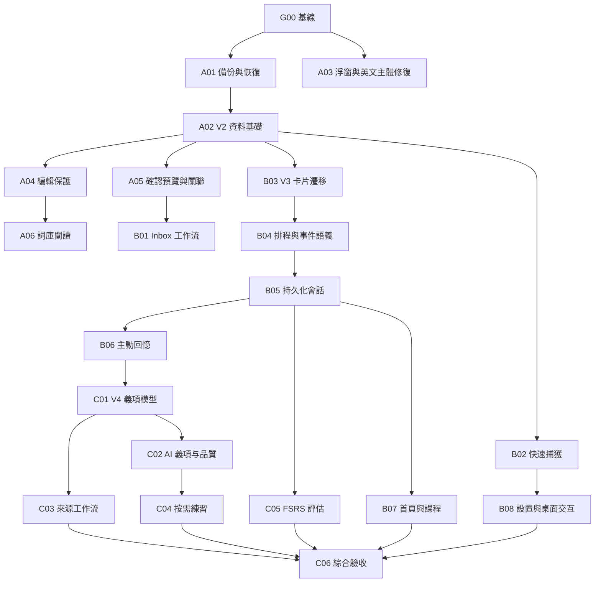

# 13. Supplemental Development Plan

日期：2026-10-07（Asia/Hong_Kong）。

狀態：已獲授權開始實施，按任務追蹤。代碼基線：`56b7c1a`（Add bilingual lookup and app preferences）。未勾選的目標和驗收數字不是已通過的測試結果。

## 1. 計劃定位

本計劃承接已完成的 M1-M7 與 P1-A 至 P1-G，目標是讓 Word Note 成為可以長期使用的查詞、整理與復習工具。保留 SwiftUI、SwiftData、本地優先和人工確認入庫的基礎，按垂直功能分批交付。

2026-10-07 用戶已授權按計劃持續開發、測試，並在每個里程碑或重大變更完成後推送到既有遠端倉庫，不需逐階段等待人工確認；另已授權受控的真實 DeepSeek 測試。工作分支為 `codex/supplemental-development`。破壞性資料操作和憑據/歷史改寫仍不在一般開發授權內。

README 改寫、介紹用界面截圖和倉庫敏感資訊檢查屬於 WN2-C06 的後置收尾任務，必須在本次交付範圍內的代碼修改完成、功能與回歸測試通過後再執行；G00 的隔離實機回歸截圖不是 README 介紹圖。

文檔分工：

| 文檔 | 權威內容 |
|---|---|
| 本文件 | 任務、優先級、依賴、交付順序、驗收和發布閘門 |
| [CONTEXT.md](../CONTEXT.md) | 查詢、詞條、義項、遇見記錄、卡片和復習事件的統一術語 |
| [03-ux-flows.md](03-ux-flows.md) | 各頁面和跨窗口交互 |
| [04-technical-architecture.md](04-technical-architecture.md) | 服務邊界、交易與狀態所有權 |
| [05-data-model.md](05-data-model.md) | 目標模型、兼容字段、遷移和刪除規則 |
| [06-ai-integration.md](06-ai-integration.md) | 结构化義項、模型評測、重新生成與人工內容保護 |
| [07-review-system.md](07-review-system.md) | 重學、會話、分方向排程和統計口徑 |
| [08-security-privacy.md](08-security-privacy.md) | 備份恢復、導出、權限和網絡邊界 |
| [09-quality-and-testing.md](09-quality-and-testing.md) | 測試矩陣、環境和證據要求 |
| [11-engineering-decisions.md](11-engineering-decisions.md) | 新舊決策替代關係 |

各專題新增的「2026-10 補充契約」是對應階段的實施目標。前文仍記錄當前版本；只有任務完成、測試通過並交付後，才能把目標改寫為現行行為。遇到矛盾時按任務階段及 Decision 017-020 處理，禁止混用新舊統計或排程規則。

## 2. 已核對的現狀

下表描述 `56b7c1a` 基線的代碼與文檔狀況，實施進展以任務表及 [G00/A03 執行記錄](qa/2026-10-07-g00-a03.md) 為準，尚未完成全面實機驗收。G00 的開發基線與 C06 的新版 README 截圖是不同交付物，零散的舊版觀察不能替代改碼後的驗收。

| 編號 | 現狀與影響 | 代碼依據 | 對應任務 |
|---|---|---|---|
| F01 | 中文查英文只有一個候選且無 sentenceMeaning 時，浮窗可能只顯示中文查詢和中文釋義 | [FloatingQuickAddPanel.swift](../Sources/WordNote/Presentation/FloatingQuickAddPanel.swift) 的 candidateSourceText | WN2-A03 |
| F02 | 批量確認遇到重複詞整批報錯，沒有預覽和關聯已有詞流程 | [VocabularyService.swift](../Sources/WordNoteCore/Domain/Services/VocabularyService.swift) 的 confirmCandidates | WN2-A05 |
| F03 | 編輯後切換詞條會重新載入表單，缺少未保存處理 | [TermDetailEditor.swift](../Sources/WordNote/Presentation/TermDetailEditor.swift) | WN2-A04 |
| F04 | Vocabulary 列表沒有中文釋義，詳情預設為編輯表單 | [VocabularyView.swift](../Sources/WordNote/Presentation/VocabularyView.swift) | WN2-A06 |
| F05 | Again 最早次日復習；進入 Review 會重新建立會話；兩個方向共用排程 | [ReviewView.swift](../Sources/WordNote/Presentation/ReviewView.swift)、[ReviewService.swift](../Sources/WordNoteCore/Domain/Services/ReviewService.swift) | WN2-B03 至 WN2-B06 |
| F06 | 重複查詢會增加 wrongCount、清空 streak 並降低 mastery；這是原需求實作，需要明確版本化調整 | [VocabularyService.swift](../Sources/WordNoteCore/Domain/Services/VocabularyService.swift) 的 bumpDuplicateHit | WN2-B04 |
| F07 | 浮窗新增的課程為 nil，保存錯誤只響提示音；已有快捷鍵只在 App 內生效 | [FloatingQuickAddPanel.swift](../Sources/WordNote/Presentation/FloatingQuickAddPanel.swift)、[WordNoteApp.swift](../Sources/WordNote/App/WordNoteApp.swift) | WN2-B02 |
| F08 | 一個詞條只有一份上下文、一個 courseID；多義項放在一段文字中 | [TermModel.swift](../Sources/WordNoteCore/Data/Models/TermModel.swift) | WN2-A02、WN2-C01、WN2-C03 |
| F09 | 首頁偏重存量統計，課程頁偏重資料編輯 | [DashboardView.swift](../Sources/WordNote/Presentation/DashboardView.swift)、[CoursesOverviewView.swift](../Sources/WordNote/Presentation/CoursesOverviewView.swift) | WN2-B07 |
| F10 | 只有舊 store 遷移備份，沒有日常備份、恢復預覽和詞表導出 | [WordNoteStoreLocation.swift](../Sources/WordNoteCore/Infrastructure/Persistence/WordNoteStoreLocation.swift) | WN2-A01 |

F05、F06 是本輪調整的產品規則，不把原先按需求實作的行為追認為程式錯誤。

## 3. 範圍與不變量

### 計劃交付範圍

- 修復 F01-F03，補齊英文主體校驗、可見錯誤和安全編輯。
- 詞庫閱讀模式、整理預覽、關聯已有詞、批量課程和標籤操作。
- 全局 Quick Add、課程預設、方向覆寫、朗讀及分析任務狀態。
- 分方向卡片、短期重學、持久化會話、可理解的每日目標與統計。
- 以可執行動作為中心的首頁、可直接查看詞表和復習的課程頁。
- 自動備份、完整 JSON 快照、CSV 詞表、恢復預覽。
- 多來源、多課程、结构化義項和保護人工內容的 AI 增強。

A/B 是優先交付的核心閉環；C 是其後的內容深化，不要求等到 C 全部完成才改善日常使用。C04 可在 B 驗收後依實際需求減範圍或暫緩，C05 可得出 No-Go。調整時必須更新任務表和出口，不把未實施標為完成。

### 繼續遵守

1. 正式詞條的主體是英文；中文查詢是來源內容，不能變成 Term 主體。
2. 常用本義先完整覆蓋；專業含義有實質差異才補充，不強制一兩個義項，也不硬湊多義。
3. 保存先落地再排隊；分析不得阻塞下一次輸入；失敗保留原始輸入。
4. AI 不自動確認入庫、不自動覆寫人工修改、不自行裁定掌握程度。
5. 精確重複英文查詢繼續復用正式詞庫並提高復習優先級；不能用模糊匹配擅自合併。
6. 浮窗空閒時接近輸入框大小；釋義按內容增高，失焦累計 10 秒隱藏，聚焦暫停計時。
7. API Key 留在本機 env 文件；不重新引入鑰匙串流程。
8. 已確認 Inbox 內容仍收起；處理中任務使用獨立隊列入口，不混入待確認列表。
9. 明暗主題沿用第一版研究編輯台風格與中性黑灰深色 token。

### 本計劃不包含

App 商店、公證、簽名與分發渠道；賬號、付費、社交、雲同步；完整 PDF 閱讀器、錄音轉寫、屏幕 OCR；被動剪貼板監聽；批量重寫既有釋義。FSRS 僅包含評估與採用條件，不默認更換現行算法。

## 4. 階段與依賴

工作量以 S（局部）、M（單流程跨層）、L（資料或多流程變更）表示，屬於相對估算，不承諾日曆工期。具體排期在 WN2-G00 完成後按人力與實測修訂。

| 階段 | 目的 | Schema | 出口 |
|---|---|---|---|
| G | 固定基線與回歸材料 | V1 | 缺陷可重現，測試和備份材料可用 |
| A | 安全保存、閱讀和入庫 | V1 -> V2 | 備份可恢復，已知斷點修復，詞庫日常可查閱 |
| B | 整理、捕獲和復習閉環 | V2 -> V3 | 會話可恢復，方向獨立，查詢與答錯分開 |
| C | 義項、來源與按需 AI 練習 | V3 -> V4 | 內容結構清晰，AI 品質經比較驗證 |

圖展示主依賴鏈，各任務段落列出完整前置。實際交付順序為 G、A、B、C，各階段出口通過後才讓主分支依賴下一版 schema。UI 原型、測試樣本整理可並行；持久化模型和迁移按依賴順序進行。B03 的資料遷移與 B04 的排程寫入切換須作為同一完整版本啟用，不能先讓舊 Term 和新卡片各自排程。

## 5. 可執行任務

### WN2-G00：固定基線與回歸樣本

狀態：進行中。工作量：S。依賴：無。

- 重新執行非 live 測試與 warnings-as-errors 建置，記錄實際測試數，不沿用歷史 82 項作為本輪結果。
- 用隔離測試 store 重現 F01-F03；準備空庫、現有 V1、重複候選、長詞條和多課程資料。
- 固定當前主要頁面與浮窗的淺色/深色截圖和鍵盤操作基線。
- 將真實資料驗證與可刪除測試資料隔離；付費 AI 測試仍顯式 opt-in。

驗收：測試輸出、環境信息、重現步驟和匿名樣本均可重複使用。關聯測試：QA-01、QA-02。

### WN2-A01：備份、恢復與導出

狀態：進行中，V1 核心與 App 接入代碼完成，集成測試通過、大庫核心測量完成；完整實機、表格軟件與端到端性能待補。工作量：L。依賴：WN2-G00。

- 先在 V1 上實作版本化完整邏輯快照，再啟動 schema 變更。
- 自動備份在資料有變更且距上次成功備份滿 24 小時後觸發；關閉期間不要求後台常駐，下一次啟動補做。
- 手動快照、遷移前快照、恢復前快照；自動輪替保留最近 7 份，手動與保護性快照不自動清除。
- 完整 JSON 快照與 CSV 詞表分開命名；CSV 不是完整恢復材料。
- 恢復先校驗並展示數量和版本，確認後以替換方式恢復；本輪不實作跨庫合併導入。
- 每次新增模型時同步擴展快照格式與相應版本讀取器。

驗收：V1 完整往返後 ID、關聯、候選狀態和復習歷史一致；損壞或較新格式不接觸現有 store；強制中斷可回到原庫。關聯測試：QA-03、QA-04、QA-05。

實施記錄：[A01 核心資料保護](qa/2026-10-08-a01-persistence.md)、[A01 App 接入](qa/2026-10-08-a01-app-integration.md)。在 51 項底層測試上新增 21 項 coordinator、寫入屏障、延遲 AI 回調與隊列回歸測試；Settings 恢復入口、啟動掛接和 CSV 範圍選擇已實作，離線全套 175 項中 174 通過、1 live 跳過，另行雙向 live 通過。隔離 QA 啟動已實際建立自動快照，但 Computer Use 回報 `cgWindowNotFound`，不能據此宣稱恢復 UI、CSV 實際表格軟件或大庫性能已驗收。

後續 [后台資料工作與性能記錄](qa/2026-10-08-a01-background-persistence.md)：修正大庫同步捕獲/建庫阻塞，新增 12 項並發回歸與 1 項 opt-in 性能組。該輪嚴格離線全套 188 項中 186 通過、2 跳過，live 另跑通過；Release 的 1,000/10,000 詞各 30 輪測量完成，10,000 詞后台建庫期間 MainActor 最大間隔 p95 約 15.12 ms，建庫總耗時 p95 仍約 9.33 秒。該輪 Computer Use 明確報告 Mac 鎖屏；A02 服務階段再檢查時為 `cgWindowNotFound`，不能推斷仍鎖屏，也不能據此標記實機驗收通過。

### WN2-A02：V2 捕獲與內容關聯基礎

狀態：進行中，V2 資料交易、備份恢復、受保護啟動、修復、持久隊列及隔離 QA App 接入已實作；實機驗收待補，普通 App 仍為 V1，正式啟用仍等待 A01 驗收。工作量：L。依賴：WN2-A01。

- 增加 TermOccurrence、TermCourseLink、LookupEvent 與 CandidateTerm.savedTermID；建立冪等鍵和 revision 校驗。
- 為 InputRecord 固定查詢意圖、實際方向與檢測版本，為後續手動方向覆寫留出契約。
- 從 V1 的 courseID、contextSentence、sourceRecordID 保守回填一次，保留兼容字段。
- 保留舊 wrongCount 的原始數值，新增語義版本和 legacy 標記；本階段不提前啟用 B 階段的復習規則。
- 更新新增、刪除、備份、恢復和資料完整性修復服務。

驗收：重複執行回填不增加記錄，舊詞條和 review event ID 不變，所有來源/課程可追溯，快照恢復覆盖 V2。關聯測試：QA-06、QA-07。

隔離準備記錄：[V1 凍結與 V2 資料基礎](qa/2026-10-08-a02-isolated-foundation.md)。僅在開發分支加入歷史類型、值轉換、8 實體快照及臨時庫測試；App 類型別名、啟動、寫入服務和恢復入口仍使用 V1。A01 實機閘門未通過前，不啟用正式詞庫遷移；本項也不能因模型測試通過而標為完成。

服務進展：[V2 內容交易](qa/2026-10-08-a02-content-transactions.md)。新增 37 項捕獲/確認/刪除測試及 1 項來源標記校驗，嚴格離線全套 248 項中 246 通過、2 跳過。精確命中在一次保存內記錄來源、查詢及課程；候選關聯不改人工內容或增加查錯次數；刪除遵守來源保留、級聯和課程引用保護。每個寫入入口受恢復屏障、revision 和失敗回滾保護。這只是隔離核心，單項確認不代表 A05 批量預覽/撤銷已實作；現行主 App 仍為 V1。

完整性進展：[檢查、保守修復與啟動防護](qa/2026-10-08-a02-integrity.md)。新增 17 項 V2 測試及 5 項 V1 啟動防護回歸；嚴格離線全套 270 項中 268 通過、2 跳過。V1 App 不再於備份前自動刪孤兒資料；V2 只提出安全解除失效可選引用的副本，其他衝突保留並阻止自動修復。修復副本與原 SQLite 的重開驗證通過，但正式修復 UI/切庫尚未接入。本輪 Computer Use 再次明確回報 Mac 鎖屏，實機閘門仍未通過。

備份進展：[版本化目錄、導出與后台捕獲](qa/2026-10-08-a02-versioned-backups.md)。該批新增 22 項測試；嚴格離線全套 292 項中 290 通過、2 跳過。V1/V2 共用 vault 保留各自完整格式、八類摘要及跨版本輪替；舊入口拒絕 V2，不靜默降成五類資料。V2 未保存直接編輯不由備份提交。該批尚未接入恢復切庫日誌和 App 遷移，沒有重新執行實機或性能驗收，QA-06/QA-07 不標完成。

恢復進展：[共用版本化日誌與 staging](qa/2026-10-08-a02-versioned-restore.md)。該批新增 19 項測試；嚴格離線全套 311 項中 309 通過、2 跳過。顯式 V2 模式可恢復 V1/V2 快照，后台轉換/建庫/重開校驗，下一次 bootstrap 才切換，故障按原 schema 回退；舊 V1 日誌兼容，舊入口拒絕 version 2 日誌且不重寫。

啟動進展：[受保護遷移與失敗重試](qa/2026-10-08-a02-startup-migration.md)。新增 19 項測試；嚴格離線全套 330 項中 328 通過、2 跳過，Release 定向 110 項通過。隔離啟動協調器在 UI/worker 建立前持久化遷移意圖，建立並重讀 beforeMigration 快照，前後核對源資料，再經共用日誌切庫；中斷或失敗保留原庫，明確重試前不再自動遷移。App 仍使用 V1，修復套用與 V2 讀寫/queue 接入待完成。此次 Computer Use 可讀隔離 QA 的可訪問性樹，但截圖不可用且後續原生通道斷開，實機閘門仍未通過，不推斷目前鎖屏。

修復進展：[原始證據保護與啟動修復](qa/2026-10-08-a02-startup-repair.md)。新增 18 項測試，嚴格離線全套 348 項中 346 通過、2 跳過，Release 定向 145 項通過。啟動失敗後可只讀預覽，經明確操作保存獨立證據文件，再通過同一 staged store/日誌套用可選失效引用的修復；必要引用、歧義和內容衝突不猜測、不刪行。證據文件不是合法備份、不允許普通恢復入口導入；原庫保留。V2 App/隊列和恢復界面尚未接入，仍不啟用正式詞庫遷移。

隊列進展：[持久分析交易、重試與中斷恢復](qa/2026-10-08-a02-analysis-queue.md)。本批新增 42 項測試，嚴格全套 390 項中 387 通過、3 跳過，Release 定向 203 項通過。V2 使用值型請求及 record revision/generation/attemptID/store ticket 校驗，不跨 await 持有模型；保存失敗停止付費重發，中斷必須明確恢復，重試預算跨重啟保留。已完成候選關聯、人工內容及原始捕獲不被重新分析覆寫。受控雙向 live 僅發兩次公開測試請求並通過，確認後精確重查不再調用 API。這是 A02 接入所需及 B01 共用隊列的核心，不代表三入口、任務視圖或實機驗收完成。

A02 接入進展見 [V2 隔離 App 與版本化資料保護](qa/2026-10-08-a02-app-integration.md)：新增獨立編譯標記和 QA 啟動入口，復用現有頁面，主 Quick Add、浮窗及 Inbox 重試共享一個 V2 queue。詞條/課程/候選保存經 revision 交易；多課程篩選和 CSV 使用 TermCourseLink；Settings 接入八實體備份、版本化預覽和恢復。新增 25 項測試。隔離啟動日誌確認 V1 -> V2，Computer Use 仍返回 cgWindowNotFound，不能標記 UI 已驗收。這不是 A04 完整離頁保護/撤銷，也不是 A05 衝突處理界面。

### WN2-A03：查詞展示與英文主體修復

狀態：進行中，代碼與核心測試完成，實機回歸待補。工作量：S。依賴：WN2-G00；可在 schema 工作前獨立交付。

- 浮窗按查詢方向選擇標題：中文查英文必須顯示候選英文；英文查中文沿用英文詞頭加中文釋義。
- 一個/多個候選、整句翻譯、無候選、長釋義均使用可測的展示模型。
- 檢查建詞、手動建詞、候選修改與正式詞條編輯的英文主體校驗；既有不合格資料提示修正，禁止靜默刪除。

驗收：`過擬合 -> overfitting` 單候選情況在浮窗直接可讀英文；保持內容自適應高度、10 秒失焦計時與焦點暫停。關聯測試：QA-01、QA-08。

### WN2-A04：編輯狀態與安全撤銷

狀態：進行中，V2 隔離 App 已接入值草稿、離頁/關窗/正常退出保護、三方字段對比及運行期單步安全撤銷；實機焦點/窗口/比較/撤銷交互仍待驗收。工作量：M。依賴：WN2-A02。

- Term、Course、Candidate 編輯採用獨立草稿值；保存前不把輸入框直接綁定成正式模型變更。
- 切換詞條/課程、導航離開或關閉窗口時，未保存修改提供保存、放棄、取消；取消保持原選擇和焦點。
- 保存成功更新 revision；發現另一窗口修改時展示衝突而不是覆寫。
- 字段對比顯示原值、我的草稿、目前庫中值；非重疊修改可合併到草稿，雙方對同一字段改出不同值時必須選擇 Mine/Stored。回填前重讀最新值和 revision，回填本身不保存；正式 Save 再做原有交易校驗。
- 當前 App 運行期支持最近一次編輯及確認操作的撤銷；撤銷也必須校驗後續依賴和 revision。
- 刪除仍保留明確確認；本輪不承諾永久刪除的直接撤銷或跨重啟 undo。

驗收：未保存修改不靜默丟失；撤銷不能刪掉已被其他操作引用的新詞或覆盖更新內容。關聯測試：QA-02、QA-09。

編輯保護進展：[A04 未保存編輯](qa/2026-10-08-a04-edit-protection.md)。新增 23 項測試；普通 Debug、V2 Debug/Release 全套均為 438 項中 435 通過、3 跳過。每窗口獨立草稿、即時讀取最後一次輸入、保存失敗保留離開確認、正常退出逐一處理所有窗口。同記錄多候選編輯一次交易保存，不互相製造 source revision 衝突。Computer Use 仍返回 cgWindowNotFound，因此 QA-02 和 QA-09 不標記完整通過。普通啟動仍使用 V1；本批未啟用生產 V2 或修改 README。

撤銷進展：[A04 單步安全撤銷](qa/2026-10-08-a04-safe-undo.md)。新增 31 項回歸，涵蓋編輯、確認、手動建詞、課程與成員關係；只記受影響資料的 before/after，不回滾整库，撤銷仍增加 revision。後續編輯、查詢、復習、來源/候選引用或舊名稱/關係 ID 衝突會拒絕整次撤銷；保存失敗可重試。QA 工具列與 Edit 菜單接入同一運行期 history，不攔截文字編輯的 Command-Z。只完成隔離核心和入口，不代表 A04 全部或實機已驗收。

字段對比進展：[A04 三方比較與草稿回填](qa/2026-10-08-a04-field-comparison.md)。新增 29 項測試，覆蓋強型別字段比較、過期預覽、完整表單字段、V2 寫入/撤銷整合、候選 ID 對應和來源狀態。回填不產生資料庫寫入或 undo receipt；候選新增保留、已處理/分析中候選不可回填，來源已處理時不重開手動建詞。正常 V1 不提前啟用這些 V2 控件；A04 保留實機验收缺口，後續可繼續 A05 的核心與隔離接入。

### WN2-A05：批量預覽與關聯已有詞

狀態：進行中；隔離 V2 核心與兩個 QA 確認入口已接入，實機驗收待完成。工作量：L。依賴：WN2-A02、WN2-A04。

- 新增只讀 ConfirmationPlan：列出输入記錄數、候選數、新詞數、關聯數、忽略數與待處理衝突數。
- 精確重复候選可選「關聯已有詞」「逐字段補充」「略過」；預設保留已有人工內容。
- 同一批中的新同名詞只建立一個 Term，各來源生成獨立 occurrence；含義不同時需要明確選擇處理。
- 未解决衝突禁止提交；已解決方案全量預驗證後一次保存，失败全部回滾。
- 成功保存 savedTermID、來源、課程關聯和候選狀態；重複點擊或重試不二次建詞。

驗收：批次中一個既有詞不再只能讓整批報错；計劃過期時重新預覽；入庫前後計數一致。關聯測試：QA-10、QA-11。

實施證據：[A05 確認預覽與原子提交](qa/2026-10-08-a05-confirmation-preview.md)。新增 40 項測試，覆蓋批內同名合併、既有詞默認保護、顯式四字段補充、忽略、目標歧義及切換保護、同來源去重、多來源/課程、過期/刷新、選擇綁定重試、保存失敗回滾和 A04 撤銷。V2 的 Inbox 與候選確認共用預覽；普通啟動仍是 V1。UI 驗證未完成不等於整個 A 階段已通過；B01 連續整理/篩選、B08 窗口適配另行推進。

### WN2-A06：詞庫閱讀模式

狀態：進行中，隔離 V2 核心與閱讀/整理入口已接入，實機交互及完整搜索延遲待驗收。工作量：L。依賴：WN2-A04、WN2-A05。

- 列表展示英文詞頭和中文摘要，狀態與課程降為次要信息；補全排序、標籤和最近/反復查詢篩選。
- 詳情預設為閱讀模式，顯示釋義、例句、原文、課程和學習摘要；按編輯才進表單。
- 批量添加/移除課程、修改標籤，預覽影響數量並保持原子性；批量删除不在本輪新增範圍。
- 早期先閱讀舊文字釋義，C 階段再升級成義項列表，不等待 AI 模型改造。

驗收：不打開編輯表單即可閱讀完整內容；查詢簡繁中文、篩選後選擇保持正確；批量操作不改寫釋義。關聯測試：QA-12、QA-13。

實施口徑：最近再次查詢為最近 7 x 24 小時內已有的 exactRepeat LookupEvent；反復再次查詢為至少兩個不同 captureID 的有效事件。未來時間不計入，不從 legacy wrongCount/duplicateHitCount 推造歷史事件；UI 明確稱為 re-queries，首次 AI 查詢與舊庫缺失的時間線不冒充已知。排序包含更新、新增、英文詞頭、再次查詢時間及次數；標籤按去首尾/合併空白及大小寫不敏感鍵匹配，顯示保留原拼寫。

批量整理只做课程成員和標籤的增減，不提供覆蓋全部或批量刪詞。預覽區分選中詞數、實際改動詞數、課程關係及標籤增減數；同一項同時要求增/減視為衝突。提交前重讀版本/字段/關係及課程依賴，一次保存，無效/過期/保存失敗不部分成功；已有同項時為 no-op。切換搜索或任何篩選清空批選，排序保留仍可見的 ID；閱讀與編輯切換沿用 A04 保存/放棄/取消保護。

實施證據：[A06 詞庫閱讀與批量整理](qa/2026-10-08-a06-vocabulary-reading.md)。新增 47 項功能測試與 1 項 opt-in 性能組；長釋義原文不裁切，原始來源/保存上下文分離，整理只改 membership/tags 和實際改動詞的 revision/updatedAt。普通 V1 App 未切換；Computer Use 本輪仍返回 cgWindowNotFound，不能把核心測試或進程存在當成 UI 驗收。B08 窗口策略與 C 階段義項閱讀另行推進。

### WN2-B01：Inbox 決策工作流與隊列

狀態：進行中，隔離 QA App 已接入三入口共用隊列、篩選、候選閱讀/編輯、A05 關聯預覽、相鄰項選擇及忽略撤銷；自動化和部分原生流程已核對，完整尺寸/主題/競態待驗收。工作量：M。完整工作流依賴：WN2-A05；隊列核心隨 A02 提前準備。

- 候選預設簡潔閱讀，提供保存、忽略、關聯和展開編輯；支持保存並處理下一條。
- 增加搜索、來源/課程篩選、待確認/草稿/失敗篩選；Handled（原 Confirmed）保持折疊。
- 顯示「選中輸入數」與「候選數」，全選限定當前篩選下可處理項，跨篩選不殘留隱藏選擇。
- 分析中與排隊中的記錄放在獨立任務視圖；主 Quick Add、浮窗和 Inbox 重試共用同一隊列。
- 提供安全取消排隊、失敗重試；取消已發送請求不聲稱可取消服務端計費。

驗收：整理、撤銷和下一條連續可用；單項分析失敗不阻塞後續；關閉重開保留任務和錯誤。關聯測試：QA-14、QA-15。

2026-10-08 開始補齊隔離 V2 整理界面。原 Confirmed 折疊區改稱 Handled：`completed` 也包含全部忽略的候選，不等於已入庫詞數，仍默認收起。搜索匹配輸入/備註/句意與候選英文/中英文釋義，課程和來源按捕獲記錄取交集；待確認為存在 pending 候選，失敗為分析失敗，兩者可重疊。草稿為尚無 pending 候選的非失敗 draft；queued/running 僅留在獨立任務區，不混入主列表。狀態筛選只作用於待處理列表，Handled 僅在 All 下按同一搜索/課程/來源顯示。

批選僅保留当前可見且可確認的記錄，計數分輸入數和 pending 候選數；切搜索/篩選清空批選。候選推薦勾選只在首次出現時初始化，用戶清空後不因重繪再勾回，新到候選不自動混入已選集合。候選默認閱讀，按編輯才展開草稿；保存/關聯仍走 A05 預覽，不新增跳過衝突檢查的快存路徑。部分候選處理後留在當前記錄，整條處理完按原列表中仍可見的後鄰、前鄰依次選擇，不跳到新到記錄所在的頂部。忽略候選/整條記錄接入 A04 單步撤銷，後續分析/編輯改變依賴時拒絕撤銷；取消分析不是撤銷處理，也不承諾已發送請求免計費。

實施證據：[B01 Inbox 決策工作流](qa/2026-10-08-b01-inbox-workflow.md)。新增 34 項測試；普通/V2 Debug、V2 Release 各 620 項中 616 通過、4 跳過。修復整條忽略撤銷丟失失敗/取消任務與 provider deadline 的邊界，revision 仍單調增加。Computer Use 已核對全選計數、中文搜索清選、草稿取消保護、單條關聯、部分/全部處理、忽略撤銷及緊湊窗口批量預覽；修正實機發現的更多菜單拉伸與重複失敗提示。後續工具連線中斷，剩餘主題/尺寸/競態仍待補；沒有正式切 V2 或讀寫真實詞庫。

### WN2-B02：全局捕獲與浮窗反饋

狀態：進行中；隔離快捷鍵/提交部分已實作，共享上下文與浮窗操作待接入，完整實機待驗收。工作量：L。依賴：WN2-A03、WN2-A02。

- 增加真正的系統全局快捷鍵，可設定、停用，註冊衝突可見；保留菜單欄和 App 內入口。
- 主窗口和浮窗共享預設/當前課程、來源和查詢方向；項目建立時凍結其元資料，排隊後切換課程不影響既有項目。
- 方向選擇為自動、英查中、中查英；自動模式沿用可測本地規則，手動選擇必須跨重啟重試一致。
- 浮窗顯示最小排隊數/失敗提示，按需展開任務；提供英文複製、系統朗讀和跳轉對應主窗口記錄。
- 主 Quick Add 的主要提交快捷鍵統一為 Command-Return「保存並分析」；草稿另提供明確操作，中文組合輸入優先。

驗收：在其他 App 前台可喚起和切換浮窗；發音不自動播放；無可用聲音有明確狀態；無釋義時不預留結果高度。關聯測試：QA-16、QA-17、QA-18。

2026-10-08 第一批：可配置/停用的系統註冊、系統保留鍵及排他衝突提示、改綁失敗保留原鍵、長按去重、恢復期間停用和同一浮窗切換已接入 V2 QA。主 Quick Add 的 Command-Return 改為保存並分析，原生編輯框保護 IME marked text，Tab 仍需顯式接受灰色補全。新增 28 項測試與原生 opt-in 註冊檢查；詳見 [B02 快捷鍵與提交記錄](qa/2026-10-08-b02-capture-shortcut.md)。普通 V1 不啟用全局鍵，未遷移真實詞庫；本批不縮減上述共享元資料、方向、浮窗結果操作和生命週期的剩餘範圍。

普通/V2 Debug、V2 Release 嚴格全套各 648 項中 643 通過、5 跳過；另行啟用的 43 項定向及 2 項 Release 原生註冊均通過。原生事件註冊與 AppKit 組件測試不等同跨 App 觸發；Computer Use 讀到隔離首頁後連線中斷，設置和實際中文 IME 操作仍未驗收。後續先完成共享捕獲和浮窗功能，再補完整 UI 清單。

### WN2-B03：V3 卡片與歷史兼容

狀態：待實施。工作量：L。依賴：WN2-A02、WN2-A01。

- 新增 ReviewCard、ReviewSession、ReviewSessionItem，擴展 ReviewEvent 的 cardID、sessionID、冪等 actionID 和反饋語義版本。
- 同版準備 B06 的原句填空目標及 sibling 暫時埋藏字段；C01 才增加可選 senseID。
- 把詞條排程移至卡片，保留既有詞條字段作兼容快照。
- 舊排程只遷到一張主卡，不複製成兩張同時到期卡；方向依最後一條有效 ReviewEvent，無事件時選英文識別。
- 其他方向由使用者啟用後按新卡規則開始，不繼承猜測的掌握程度。
- 舊 wrongCount 保留為歷史混合計數；新實際遺忘率只用新語義事件計算。

驗收：遷移不憑空增加到期工作量、補答題歷史或改寫舊事件；每張卡 ID 可穩定恢復，快照包含 V3。關聯測試：QA-19、QA-20。

### WN2-B04：短期重學與查詢信號分離

狀態：待實施。工作量：L。依賴：WN2-B03。

- 啟用 [07](07-review-system.md) 的版本化反饋規則、10 分鐘重學與每日上限。
- 明確區分 Again「未能回憶」和 Hard「想起來但費力」，只有 Again 增加新的 lapseCount。
- 精確重複查詢復用本地釋義、記 LookupEvent、提高優先級；不再直接增加實際錯題或重置 mastery/streak。
- 到期判斷區分日級復習與分鐘級重學，不能用 endOfToday 把未到時間的重學提前抽出。
- 在答題按鈕上顯示本次操作後的排程預覽；預覽和保存使用同一 scheduler。

驗收：重學有等待狀態和次數上限；重复查詞仍進入待復習，但不偽造答錯；跨午夜、夏令時和時鐘改動用例可測。關聯測試：QA-21、QA-22。

### WN2-B05：可恢復復習會話

狀態：待實施。工作量：L。依賴：WN2-B04。

- 預設每組 20 張不同卡、每日最多引入 10 張新卡，可在設定修改；已到期和重學優先，不以補滿目標為由自動增加新卡。
- 保存會話範圍、隊列、當前卡、操作結果和重學待辦；切換欄目、重啟後可繼續。
- 同一會話只允許一個窗口提交回答；重複回調、恢復重試以 actionID 去重。
- 暫停、結束、完成和等待重學分開；完成一組不等於今日全部到期清空。
- 顯示不同卡完成量、回答次數、首次回憶成功率和延期量，不把重學反覆回答當新增完成。

驗收：任意一次保存前後中斷不重複計分或丟失進度；卡片刪除、課程變更和新詞加入不造成無限延長本輪。關聯測試：QA-23、QA-24。

### WN2-B06：主動回憶與原句填空

狀態：待實施。工作量：M。依賴：WN2-B05。

- 英文識別與中文回憶各自排程；回憶模式可選先輸入英文，再查看答案並自行反饋。
- 原句填空先只使用有明確匹配片段的真實英文原文；單獨詞頭、中文查詢或無法定位答案的句子不能硬生成填空。
- 每個目標範圍保存穩定填空位置與答案形式，不使用無邊界的全局字符串替換；同詞其他方向/義項在揭示後延至次日，避免照答案回憶。
- 不確定的同義表達標為需自行確認；可接受答案和原詞都可查看，模型評語不自動寫排程。

驗收：正面不洩露答案；連字符、屈折形式、多次出現詞條和中文輸入法正常；練習與正式復習記錄分開。關聯測試：QA-25、QA-26。

### WN2-B07：首頁與課程學習入口

狀態：待實施。工作量：M。依賴：WN2-A06、WN2-B01、WN2-B05。

- 首頁優先呈現繼續會話、開始一組復習、整理 Inbox；所有項目可直達具體卡片、記錄或詞條。
- 今日完成量和首次回憶成功率直接來自新事件；總詞量、課程數作為次要信息。
- 課程頁顯示去重詞表、到期卡、薄弱詞與最近遇見記錄，支持帶課程上下文新增和復習。
- 多課程共用同一詞條，不複製學習狀態；全局統計去重，課程統計明確按所屬範圍計算。

驗收：Dashboard、Review 和 Courses 對同一時間和範圍數值一致；深鏈返回保留搜索和選中項。關聯測試：QA-27、QA-28。

### WN2-B08：設定與桌面交互統一

狀態：待實施。工作量：M。依賴：WN2-B02、WN2-B05、WN2-A01。

- Settings 分成一般、捕獲、學習、AI、資料；提供預設課程、快捷鍵、每日目標、連接測試和備份狀態。
- 使用 macOS 標準設置窗口，主側欄的設置入口也路由到同一窗口，避免兩份互相獨立的設定表單。
- 主列表分隔線可拖動，側欄可手動隱藏，寬度按窗口保存；窄窗口優先保證正在閱讀的內容。
- UI 文案抽入本地化資源，提供繁體中文、簡體中文和英文；預設依系統語言回退，不翻譯使用者原文或詞條。
- 統一 toolbar、焦點、tooltip、VoiceOver 名稱和明暗對比，移除佔據內容區的操作說明。

驗收：不同窗口偏好即時一致；支持既有最低 980x680、1320x800 和 1920x1080 窗口；長詞頭、長課程名與大字體不遮擋操作。關聯測試：QA-29、QA-30。

### WN2-C01：V4 義項與內容版本

狀態：待實施。工作量：L。依賴：WN2-B03、WN2-B06、WN2-A01。

- 新增 TermSense、CandidateSense、ContentRevision；已有詞條作詞頭，義項作可編輯內容單位。
- 舊中文釋義完整包成一個 legacy 義項，禁止靠分號猜測或在遷移時請求 AI 拆分。
- 卡片增加可選 senseID；整詞卡繼續使用，不因生成多義項自動成倍增加復習卡。
- 記錄內容来源、人工修改、prompt/schema/model 版本和可追溯修訂，不把模型自報 confidence 當品質分數。

驗收：舊字串逐字保留；相同義項多次更新不改 ID；删除義項有引用處理；V4 完整往返不丟內容。關聯測試：QA-31、QA-32。

### WN2-C02：结构化 AI 與品質比較

狀態：待實施。工作量：L。依賴：WN2-C01。

- 引入 analysis schema v2，按本義、專業義、詞性、搭配、英文定義和例句组织輸出。
- 有原句時標示命中義項，無法判斷時保留未確定狀態；不把使用者僅查詞頭的記錄偽造成原句語境。
- 重新生成先建立建議修訂並展示差異，只在逐項接受後更新正式內容。
- 建立 60 個固定樣本、mock 契約測試及 opt-in live 評测，對比目前提示詞與候選改版。
- 在 Settings 展示選定服務/模型與最近連接測試狀態；模型替換須經相同評測，不以型號新舊作為品質依據。

驗收：硬性字段/英文主體/人工內容保護規則 100% 通過；人工評分達到 [06](06-ai-integration.md) 定義的門檻；延遲與成本有測量結果。關聯測試：QA-33、QA-34。

### WN2-C03：多來源閱讀與追溯

狀態：待實施。工作量：M。依賴：WN2-C01、WN2-A02、WN2-B07。

- 詞條閱讀頁提供按時間排列的遇見記錄、課程、原句與來源信息。
- 可手動添加來源標題、網址和頁碼；URL 只作可見來源，不背景爬取網頁或讀取其他 App 內容。
- 相同詞在新課程精確命中時仍可零 AI 成本保存新的遇見記錄。
- 原文、使用者備註和 AI 例句清楚區分；後續解除課程關聯不抹除歷史發生事實。

驗收：同詞跨課程兩次遇見只產生一個 Term，但來源可分別查看；刪除來源不改人工釋義。關聯測試：QA-35。

### WN2-C04：按需辨析與表達練習

狀態：待實施。工作量：M。依賴：WN2-C02、WN2-B06。

- 支持選定詞條/義項的近義辨析、自然表達建議，以及一題式填空或造句練習。
- 一次操作只發送用戶選中的有限內容，顯示生成/失敗/重試；不批量掃描整個詞庫。
- 生成題目和反饋帶 AI 標記；缺少可信答案時不判為錯誤，使用者可忽略或修訂。
- 默認僅影響練習狀態；只有使用者明確提交正式復習反饋時才寫 ReviewEvent。

驗收：多種合理答案不被機械誤判；取消或失敗不改復習計數；網絡不可用仍可使用既有詞條與普通復習。關聯測試：QA-36。

### WN2-C05：FSRS 採用評估

狀態：待評估。工作量：M。依賴：WN2-B05。

- 以成熟、可維護的實作作為候選，檢查授權、Swift 集成、離線能力和版本固定策略。
- 只用語義可靠的實際 ReviewEvent 做離線回放；舊 Hard/重複查詢混合統計不得當成標準訓練資料。
- 比較到期工作量、排程穩定性和可解釋性；樣本不足時記錄不足，不宣稱個人化效果。
- 產出採用或暫緩的評估記錄。採用需追加具體遷移 ADR、回滾和獨立任務，不能在本任务內直接更換用戶算法。

驗收：有可重跑比較材料、成本與風險，以及明確 Go/No-Go 結論；No-Go 不阻塞其餘 C 階段交付。關聯測試：QA-37。

### WN2-C06：綜合回歸與交付記錄

狀態：待實施。工作量：M。依賴：A/B 出口及 WN2-C01 至 WN2-C05（含 No-Go 結論）。

- 回歸 V1/V2/V3 至 V4 遷移、完整備份恢復、原有補全和浮窗、中文查英文、批量整理及復習恢復。
- 測試多窗口、短時間連續提交、斷網、限流、異常 JSON、磁碟不足和恢復中斷。
- 形成發布記錄，逐項鏈接測試證據、已知限制、schema/快照格式和回退步驟。
- 在上述代碼與測試完成後更新 README：包含項目定位、適用場景、已實現功能、基本使用流程、啟動與配置方式、已知限制及工程文檔入口；規劃功能不得寫成已支持。
- 通過 Computer Use 等實機工具取得新版界面截圖，介紹首頁、Inbox、Vocabulary、Review 和快速加詞浮窗等主要流程。使用隔離的演示資料，圖片存入倉庫並配簡短說明；不得使用設計稿冒充實際界面，也不得包含 key、個人詞庫原文、私人路徑或其他敏感內容。
- README 與截圖完成後，檢查待交付工作樹、暫存區和本地可達 Git 歷史：區分真實憑據、測試占位值及主機地址/用戶名等運維資訊；同時檢查環境文件、私鑰、資料庫、導出、日誌與圖片是否意外納入提交。記錄掃描範圍、版本、工具、排除項及人工覆核結果，不輸出密鑰原文，不以 `.gitignore` 代替歷史檢查。
- 真實憑據或私人資料問題未處理時停止提交/推送；需要撤銷或輪換憑據、改寫 Git 歷史、移除運維配置時先說明影響並取得相應授權。歷史無法完整檢查時明確保留未驗證項，不宣稱倉庫絕對安全。
- 最後同步 docs 已完成狀態，核對 README 鏈接和圖片可讀性；不以文檔寫完代替功能驗收。收尾期間若再次改碼或加入文件，重跑受影響測試並複核最終待提交內容。

執行順序：代碼完成 -> 功能與回歸測試通過 -> README 與新版實機截圖 -> 敏感資訊檢查與處置 -> 最終交付核對。現在上述收尾項均為待執行；既有或提前取得的截圖、掃描結果不能代替最終版本檢查。提交和推送仍各自遵循用戶授權。

驗收：所有適用 QA 項通過或有明確不適用理由，無未處理資料丟失/英文主體/恢復阻塞問題；README 與實際功能一致、界面截圖可讀且不含私人資料、敏感資訊檢查留有範圍與處置記錄，無未處理的憑據或私人資料洩漏。關聯測試：QA-38。

## 6. 交付追蹤表

任務開始後把狀態改為「進行中」，交付後再填 commit 與測試證據。初始狀態不得預先打勾。

| 任務 | 狀態 | 工作量 | 交付 commit / 測試證據 |
|---|---|---|---|
| WN2-G00 | 進行中，UI 待補 | S | [基線、固定 V1 fixture 與工具限制](qa/2026-10-07-g00-a03.md) |
| WN2-A01 | 進行中，核心/App/大庫測量完成，UI 待補 | L | [核心資料保護](qa/2026-10-08-a01-persistence.md)、[App 接入](qa/2026-10-08-a01-app-integration.md)、[后台與性能](qa/2026-10-08-a01-background-persistence.md) |
| WN2-A02 | 進行中，隔離資料/交易/備份恢復/遷移修復/隊列完成，App 及實機待補 | L | [V1 凍結與 V2 快照](qa/2026-10-08-a02-isolated-foundation.md)、[內容交易](qa/2026-10-08-a02-content-transactions.md)、[完整性與啟動防護](qa/2026-10-08-a02-integrity.md)、[版本化備份](qa/2026-10-08-a02-versioned-backups.md)、[版本化恢復](qa/2026-10-08-a02-versioned-restore.md)、[啟動遷移](qa/2026-10-08-a02-startup-migration.md)、[受保護修復](qa/2026-10-08-a02-startup-repair.md)、[持久分析隊列](qa/2026-10-08-a02-analysis-queue.md) |
| WN2-A03 | 進行中，UI 待補 | S | [14 項回歸、完整離線測試及真實雙向查詞](qa/2026-10-07-g00-a03.md) |
| WN2-A04 | 進行中，隔離 App 編輯保護、字段對比及安全撤銷已接入，實機待驗收 | M | [編輯保護](qa/2026-10-08-a04-edit-protection.md)、[撤銷](qa/2026-10-08-a04-safe-undo.md)、[字段比較](qa/2026-10-08-a04-field-comparison.md) |
| WN2-A05 | 進行中，隔離核心與 QA 預覽入口已接入；實機待驗收 | L | [40 項回歸與驗證記錄](qa/2026-10-08-a05-confirmation-preview.md) |
| WN2-A06 | 進行中，隔離閱讀/篩選/整理已接入，實機與完整延遲待補 | L | [47 項功能回歸與核心性能記錄](qa/2026-10-08-a06-vocabulary-reading.md) |
| WN2-B01 | 進行中，核心和部分原生流程通過，完整主題/尺寸/競態待補 | M | [持久分析隊列](qa/2026-10-08-a02-analysis-queue.md)、[34 項 Inbox 回歸及實機記錄](qa/2026-10-08-b01-inbox-workflow.md) |
| WN2-B02 | 進行中，快捷鍵/提交已接入隔離 V2，共享上下文/浮窗操作與實機待補 | L | [28 項新增回歸與原生註冊證據](qa/2026-10-08-b02-capture-shortcut.md) |
| WN2-B03 | 待實施 | L | 待填 |
| WN2-B04 | 待實施 | L | 待填 |
| WN2-B05 | 待實施 | L | 待填 |
| WN2-B06 | 待實施 | M | 待填 |
| WN2-B07 | 待實施 | M | 待填 |
| WN2-B08 | 待實施 | M | 待填 |
| WN2-C01 | 待實施 | L | 待填 |
| WN2-C02 | 待實施 | L | 待填 |
| WN2-C03 | 待實施 | M | 待填 |
| WN2-C04 | 待實施 | M | 待填 |
| WN2-C05 | 待評估 | M | 待填 |
| WN2-C06 | 待實施 | M | 待填 |

## 7. 階段出口與驗收方法

### A 出口

- [ ] 備份可完整恢復且憑據不在快照內。
- [ ] F01-F03 可重現的回歸測試通過，正式詞條英文主體受保護。
- [ ] 重複候選可預覽和關聯，資料提交及撤銷保持一致。
- [ ] 詞庫閱讀模式、簡繁搜索、批量課程與標籤可用。
- [ ] V1 -> V2 在隔離副本上完成，中斷後可恢復。

### B 出口

- [ ] 捕獲、失敗重試和 Inbox 共用隊列，所有入口有可見狀態。
- [ ] 全局快捷鍵、方向覆寫和預設課程通過實機回歸。
- [ ] 新舊歷史語義分開，兩種方向不相互提升掌握程度。
- [ ] 重學不提前、不無限循環，會話可中斷恢復且不重複計分。
- [ ] 首頁、課程、復習對完成量和待辦數使用同一口徑。
- [ ] 三語文案、明暗、窄窗口、鍵盤與 VoiceOver 路徑驗收。

### C 出口

- [ ] V4 遷移不自動調用 AI，不丟失原釋義和卡片 ID。
- [ ] 再生成保護人工內容；義項不自動擴大復習負擔。
- [ ] AI 評測達標；品質、成本和延遲均有對照證據。
- [ ] 多來源可追溯，AI 練習不自行改排程。
- [ ] FSRS 有採用或暫緩記錄；綜合回歸可重跑。
- [ ] 代碼及測試完成後，README 已更新項目簡介與新版界面截圖，且與實際功能一致。
- [ ] README/截圖完成後，最終待交付內容及本地可達 Git 歷史已完成敏感資訊檢查，問題已處置或明確阻止交付。

## 8. 指標與門檻

以下是目標，必須在指定機器和資料集上實測後填寫；只在本機記錄去內容化的時間與數量，不加入遠端 analytics。

| 指標 | 定義 | 目標/判定 |
|---|---|---|
| 連續保存 | 按提交到輸入框可接受下一次內容，不含模型耗時 | 1,000 詞基線下 p95 <= 300 ms |
| 本地搜索 | 停止輸入到結果列表穩定 | 10,000 詞基線下 p95 <= 200 ms，UI 不阻塞 |
| UI 首次入庫操作 | 單一合格新候選，從可見結果到確認保存 | 最多 2 次主要動作，不強制填完整表單 |
| 英文主體正確性 | 中查英的正式 Term 不含中文主體且保留中文釋義 | 固定契約樣本 100% 通過 |
| 保存與恢復完整性 | 往返後實體 ID、文本、關係、事件和數量一致 | 100%；任一丟失阻塞發布 |
| 首次回憶成功率 | 使用者當地日每卡第一個有效新語義事件中 Hard/Good/Easy 的比例 | 展示分子/分母；無資料顯示空值，不能偽造目標達成 |
| AI 首個可用結果耗時 | 發送請求到得到通過 schema 的結果 | 同樣本對照 p50/p95；不把不可控網絡延遲寫成固定承諾 |
| 人工修正負擔 | 評測中候選需修正核心義項或詞頭的比例 | 相比舊版不增加，且滿足 [06](06-ai-integration.md) 品質門檻 |

對生產詞庫不跑壓測、不灌入測試詞；性能測試使用生成資料，語義品質使用審定樣本。

## 9. 風險與處理

| 風險 | 處理與停止條件 |
|---|---|
| V1 schema 直接引用當前 model，修改類別可能改變舊版本描述 | 先凍結歷史 schema 定義，建立真實 V1 fixture，遷移測試失敗停止模型交付 |
| 舊 wrongCount 混合實際答錯與查詢 | 原值保留，新增語義版本；不可用減法猜測原始錯題 |
| 多義項/多方向使卡片暴增 | 僅遷移一張主卡，其他卡由用戶啟用並受新卡配額限制 |
| 確認預覽後資料被另一窗口修改 | revision 預檢和冪等 actionID，發現衝突要求刷新預覽 |
| 恢復期間仍有 AI 回調寫入 | 關閉寫入入口、取消/排空任務、隔離驗證再替換，未完成前不可恢復普通寫入 |
| 新 AI 輸出更長但不更準確 | 固定樣本與人工品質閘門；不達標保留舊預設，不批量重写词库 |
| 全局快捷鍵或朗讀受系統能力影響 | 在最低支持系統做小型可行性驗證；衝突/聲音缺失可見且保留菜單欄入口 |
| 計劃範圍過大 | 每階段可獨立交付，FSRS 等評估項不阻塞已穩定功能；不擴展到分發與雲端 |

## 10. 開發與回退規則

1. 每個任務先確認對應專題契約，提交同時包含必要測試和文檔狀態。
2. 有 schema 變更的任務必須先完成快照讀寫與前一版 fixture 驗證；不得直接打開唯一真實庫試遷移。
3. 小步提交；代碼回退與資料回退分開處理。舊程式不得直接開啟較新的 store，回退須使用遷移前快照重建相容庫。
4. 日常測試離線；live 測試保留 `RUN_LIVE_DEEPSEEK_TESTS=1` 閘門，測試記錄不能暴露 key、原文或私人詞庫。
5. 每阶段完成需跑適用測試、嚴格建置和 App bundle 實機驗證；UI 工具不可用時不得把視覺驗收標為已通過。
6. 計劃新增之外的破壞性操作、雲端傳輸或算法自動切換，先補充具體規格與影響分析。

開始實施時的第一批任務為 WN2-G00、WN2-A01、WN2-A03；之後按依賴推进 WN2-A02、WN2-A04、WN2-A05、WN2-A06。

## 11. 假設與待驗證事項

| 項目 | 目前判斷 | 驗證/退出方式 |
|---|---|---|
| 頁面是否需要整體重畫 | 先保留已選視覺，優先閱讀層級與交互；新視覺尚未實機核驗 | G00 收集實際窗口截圖，A06/B08 驗收；不憑舊截圖定所有尺寸 |
| 重複查詞是否代表遺忘 | 不足以判定，可為核對拼寫/用法；仍是優先信號 | B04 新事件分流，觀察後續真實反饋，不補造歷史失敗 |
| 更複雜算法是否更合適 | 未證明；資料語義修復優先 | C05 固定實作與回放比較，不足則 No-Go |
| 10 分鐘/2 次/20 張/10 新卡是否適合本人 | 可實施的初始預設，不是已證明最佳 | B 階段驗收觀察等待、完成量與負擔，再版本化調整 |
| 60 例能否保證所有釋義 | 不能，只能提供固定回歸與局部對照 | C02 保留人工確認、來源標記和修訂；新錯例加入後續集 |
| 全局快捷鍵的權限與衝突 | 需最低系統驗證，不先索取監聽權限 | B02 可行性小樣本；失敗仍保留菜單欄，不冒充功能完成 |
| 日常備份磁碟與真實庫規模 | 本輪未量測 | G00/A01 用副本記錄大小/耗時；不足不刪保護快照 |

外部依據核對於 2026-10-07：[Apple SchemaMigrationPlan](https://developer.apple.com/documentation/swiftdata/schemamigrationplan) 用於版本化遷移邊界；[Anki 官方 FSRS 說明](https://docs.ankiweb.net/manual/deck-options#fsrs) 用於反饋語義、歷史品質與重排工作量的風險參考。這些是框架/算法邊界的依據，不是本項目已通過測試或新設計必然提升記憶效果的證據。
